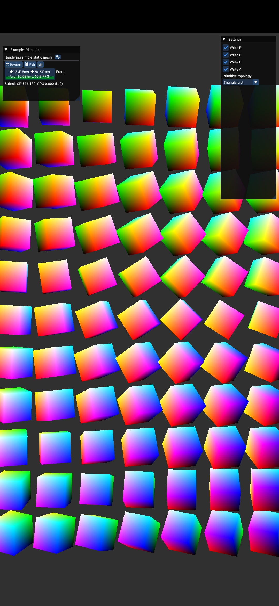

# Native Activity BGFX

Use [Native Activity](https://github.com/android/ndk-samples/tree/main/native-activity) build bgfx examples.

bgfx default android build .so, need to use it build .apk.

## Pre-requisites

- Android Studio 2022.(maybe can lower)
- NDK and `ANDROID_NDK_ROOT` env

## Get start

```
git clone https://github.com/crossous/native-activity-bgfx.git
cd native-activity-bgfx
git submodule update --init --recursive
```

Open project in Android Studio.

Before we build, we need to make a few modify.

bgfx example depend asset need to copy to sdcard, it set work space in `bgfx.cmake\bgfx\examples\common\entry\entry_android.cpp`, find string `chdir("/sdcard/bgfx/examples/runtime")`.

After Android 11+, app can not access sdcard dir, need to access `/sdcard/Android/data/<package name>/files`.

I can not submit it change to git because this code is submodule, so we modify this code in local repo.

```C++
// entry_android.cpp

const std::string GetExtStoragePath()
{
    android_app* app = s_ctx.m_app;
    ANativeActivity* activity = app->activity;
    JNIEnv* env = nullptr;

    (*activity->vm).AttachCurrentThread(&env, 0);

    jclass clazz = env->GetObjectClass(activity->clazz);
    jmethodID methodID = env->GetMethodID(clazz, "getExternalFilesDir", "(Ljava/lang/String;)Ljava/io/File;");
    jobject file = env->CallObjectMethod(activity->clazz, methodID, NULL);

    jclass fileClass = env->FindClass("java/io/File");
    jmethodID getAbsolutePath = env->GetMethodID(fileClass, "getAbsolutePath", "()Ljava/lang/String;");
    jobject result = env->CallObjectMethod(file, getAbsolutePath);

    jboolean isCopy;
    std::string res = env->GetStringUTFChars((jstring)result, &isCopy);

    env->DeleteLocalRef(file);
    env->DeleteLocalRef(result);

    return res;
}

// in MainThreadEntry::threadFunc

//int32_t result = chdir("/sdcard/bgfx/examples/runtime");
const std::string resPath = GetExtStoragePath() + "/bgfx/examples/runtime";
int32_t result = chdir(resPath.c_str());
BX_ASSERT(0 == result
    , "Failed to chdir to directory (errno: %d, path: %s, android.permission.WRITE_EXTERNAL_STORAGE?)."
    , errno
    , resPath.c_str()
    );
```

Then build project in Android Studio in `Build` > `Make Project`, and install to mobile.

## Run

Before you run app you need copy example asset to mobile, you can use adb command:`adb push examples/runtime /sdcard/Android/data/<package name>/files/bgfx/examples/runtime`, in this project, run this:
```
adb push examples/runtime /sdcard/Android/data/com.example.native_activity_bgfx/files/bgfx/examples/runtime
```

Run app:

